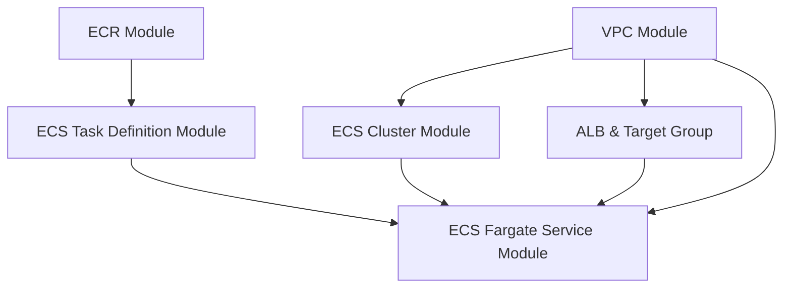

# ECS Fargate Terraform Architecture

---

# Project Documentation

## Overview
This project uses Terraform modules to provision a secure, scalable, and modular AWS ECS Fargate environment with:
- VPC (networking)
- ECR (container image repository)
- ECS Cluster
- ECS Task Definition (with IAM role)
- Application Load Balancer (ALB)
- ECS Fargate Service (with autoscaling)

## Module Breakdown

### 1. VPC Module
- Provisions a VPC with public and private subnets.
- Outputs subnet IDs for use by other modules.

### 2. ECR Module
- Creates a secure ECR repository for your Docker images.
- Outputs the repository URL for use in the task definition.

### 3. ECS Cluster Module
- Provisions an ECS cluster with container insights enabled.

### 4. ECS Task Definition Module
- Creates an ECS task definition referencing the ECR image.
- Manages the required IAM execution role.
- Outputs the task definition ARN.

### 5. ALB & Target Group
- Provisions an Application Load Balancer and target group for the ECS service.

### 6. ECS Fargate Service Module
- Deploys the ECS service using the task definition and cluster.
- Integrates with the ALB for traffic routing.
- Supports autoscaling based on CPU utilization.

## How It Works
1. **VPC** is created first, providing networking for all resources.
2. **ECR** is created for storing your Docker images.
3. **ECS Cluster** is created in the VPC.
4. **ALB** and target group are created in the VPC.
5. **ECS Task Definition** is created, referencing the ECR image.
6. **ECS Fargate Service** is deployed, using the cluster, task definition, subnets, security groups, and ALB.

## Deployment Flow
- Build and push your Docker image to ECR.
- Run `terraform apply` to provision all resources.
- The ECS service will automatically pull the image from ECR and run it behind the ALB.

## Security
- All resources use least-privilege IAM roles.
- Services run in private subnets.
- ALB is internet-facing, but ECS tasks are only accessible via the ALB.

---

For any changes, update the relevant module or variable and re-apply Terraform.
